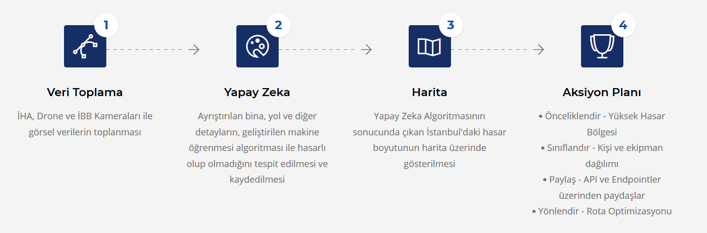
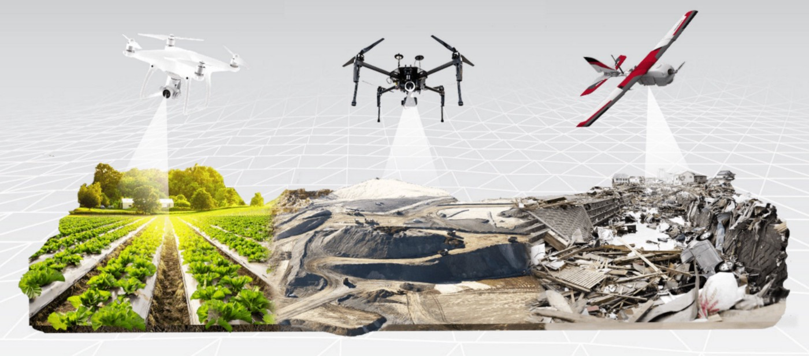

# İstanbul Büyükşehir Belediyesi Deprem Hackathonu

## Hasar Tespit İletişim Sistemi (HATİS)

İstanbul'da gerçekleşecek olan deprem sonrasında, en kısa sürede Yapay Zeka (görüntü işleme teknolojisi) kullanılarak hasar tespitinin yapılması ve bunun sonucunda kurumları (AFAD, AKOM, AKUT, STK'lar ve yabancı ekiplerin) Optimizasyon ile organize ederek doğru kaynağı doğru noktaya yönlendirerek uçtan uca çözüm üretmektir.

Deprem Hackathonu resmi sayfası: https://depremhackathonu.ibb.istanbul/

## Proje Detayı

İstanbul'da bir deprem olmaması hepimiz temennisidir. Fakat olası bir deprem sonrasında, olaylara en kısa sürede müdahale edilmesi, büyük kayıpların önüne geçecektir. Bu sebeple, Yapay Zeka ve Optimizasyon destekli uçtan uca projemiz, deprem sonrasında tüm kaynakların en verimli ve en hızlı şekilde doğru noktalara ulaştırmayı amaçlamaktadır. Proje iki ana parçadan oluşmaktadır. Hasar Tespiti ve Aksiyon Planlama. Hasar tespiti ile tüm İstanbul'daki yerleşim yerleri ve yolların hasar durumu tespit edilirken, Aksiyon Planlama aşamasında Kurumların (AFAD, AKOM, vb.) afet bölgelerine önceliklendirilmiş yerlerden başlayarak optimum kişi ve ekipmanın lojistiğinin yapılması planlanmaktadır. Aşağıda projenin detaylarına ulaşabilirsiniz.

### Hasar Tespiti

İstanbul hem çok büyük (5.343 km2) hem de çok kalabalık (16 Milyon) bir şehirdir. İstanbul'a bağlı 39 ilçe, 782 mahalle ve 152 köy bulunmaktadır. Olası bir deprem sonrasında, hasarın nerede ne büyüklükte olduğunun tespiti alınacak tüm aksiyonun temelini oluşturacaktır. Bu sebeple deprem gerçekleştikten çok kısa bir süre sonra İstanbul'un (tabiri caizse) resmi çekilmelidir.

### Görüntülerin Elde Edilmesi

⦁ İHA ve Drone: Profesyonel İHA'lar 20 saat üzerinde havada kalabilmekte ve 100 knot (180km/saat) ulaşabilmektedir. İstanbul'un kuş uçuşu maksimum mesafesi doğudan batıya 150km, kuzeyden güneye ise 70km'dir. Profesyonel bir İHA'nın tüm İstanbul'u kayıt altına alması en az 70 saat sürecektir. Fakat sadece yerleşim yerleri ve nüfus yoğunluğu dikkate alınarak bu hesaplama yapıldığında 20 saatin altında bir süre ile İstanbul'daki yerleşim yerlerinin ve yolların görüntüleri elde edilebilmektedir.

 

⦁ İBB Kameraları: Hali hazıra İBB tarafından kullanımda olan, Trafik kameraları, Turist kameraları, Şehir kameraları kullanılarak, kameraların çevresindeki yerleşim yerleri ve yolların görüntüleri elde edilebilir. Küçük Çamlıca'da inşa edilen radyo kulesi gibi kameraların sayısı arttırılarak, İHA ve Drone ihtiyacı olmadan da görüntüler sadece İBB'nin iç kaynakları da elde edilebilir olacaktır.

 

### Görüntülerin Hazırlanması

Elde edilen görüntüler, yapay zeka modeline girmeden önce ayrıştırılması gerekmektedir. Her bir yerleşim yerinin ve ulaşım yolunun ayrı ayrı modele girmesi gerektiği için, bu işlem önem arz etmektedir.

### Hasar Tespiti

Elde edilen görüntülerle Yapay zeka algoritmaları kullanarak, her bir yerleşim yerinin hasarlı olup olmadığı, hasarlı ise yüzde kaç hasarlı olduğu tespit edilmektedir. Tüm binaların ve yolların hasar oranı kullanılarak, hasar haritası oluşturulmakta ve bu harita sayesinde de doğru aksiyonlar alınmaktadır. Hasar tespiti için geliştirdiğimiz derin öğrenme algoritmamızı ve demoları [Jupyter Notebook'lardan](notebooks/) inceleyebilirsiniz.

 

### Hasar Haritası

İstanbul'un tüm yerleşim yerlerine ait hasar oranı ve İBB'nin veri kaynaklarından elde edilen adrese dayalı nüfus bilgisi kullanılarak, harita üzerinde bina hasar dağılımı ve nüfus hasar dağılımı elde edilmektedir. Her bir ilçenin kendi nüfuslarına göre hasar oranları görülebildiği gibi, ilçelerin İstanbul içindeki hasar oranlarına da ulaşılabilmektedir.

<noscript></noscript><object class='tableauViz'  style='display:none;'><param name='host_url' value='https%3A%2F%2Fpublic.tableau.com%2F' /> <param name='embed_code_version' value='3' /> <param name='site_root' value='' /><param name='name' value='DepremDashboard&#47;Dashboard1' /><param name='tabs' value='no' /><param name='toolbar' value='yes' /><param name='static_image' value='https:&#47;&#47;public.tableau.com&#47;static&#47;images&#47;De&#47;DepremDashboard&#47;Dashboard1&#47;1.png' /> <param name='animate_transition' value='yes' /><param name='display_static_image' value='yes' /><param name='display_spinner' value='yes' /><param name='display_overlay' value='yes' /><param name='display_count' value='yes' /></object>
                

## Ekip

* Sabri Suyunu ([GitHub](https://github.com/suyosunu)) ([LinkedIn](https://www.linkedin.com/in/suyunu/))
* Burak Suyunu ([GitHub](https://github.com/suyunu)) ([LinkedIn](https://www.linkedin.com/in/burak-suyunu/))
* Yavuz Selim Elmas ([LinkedIn](https://www.linkedin.com/in/yselmas/))
* Mehmet Emin Öztürk ([GitHub](https://github.com/meminozturk)) ([LinkedIn](https://www.linkedin.com/in/meminozturk/))
* Berk Baytar ([GitHub](https://github.com/BerkBaytar)) ([LinkedIn](https://www.linkedin.com/in/berkbaytar/))

